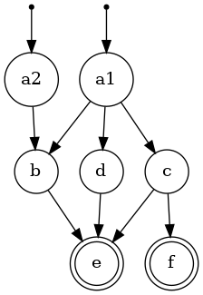

# runtasktic

[](https://github.com/Joxit/runtasktic/actions?query=workflow%3ARust)
[](https://crates.io/crates/runtasktic)
[](https://crates.io/crates/runtasktic)

Runtasktic is a _fantastic_ command-line task management tool for execution of regular long sequential or parallel tasks.

There are often tasks that we repeat several times in predefined orders. Some of these tasks can take time and we would like to be notified when it ends. This is why this project exists.

Describe your tasks in a YAML file, execute all of them with runtasktic in foreground or background. Configure the notification system, and be notified at the end of each task or when they are all finished. Onlyt Slack is supported right now, need more ? Submit a Feature Request or Pull Request.

## When should I need runtasktic ?

- when you have a redundant long running task list
- when you need a notification after a long task completion
- when you need an alternative to nohup
- when you need an alternative to crontab

## How to install runtasktic ?

You can install runtasktic via command line or by downloading the prebuild version on github.

```bash
mkdir ~/bin
curl -sSL https://github.com/Joxit/runtasktic/releases/download/$(curl -sSL https://api.github.com/repos/Joxit/runtasktic/releases/latest | jq -r '.tag_name')/runtasktic-linux-x86_64 > ~/bin/runtasktic
chmod +x ~/bin/runtasktic
```

If you are a rust user, you can use cargo to install runtasktic.

```bash
cargo install runtasktic
```

If you already installed runtasktic, you can updated it with commandline

```bash
runtasktic update
```

## CLI

```
Command-line task management tool for execution of regular long sequential or parallel tasks.

Usage: runtasktic <COMMAND>

Commands:
  run         Run all tasks from your configuration in background or foreground
  dot         Export the configuration to a graph (needs graphviz/dot)
  exec        Execute a single command with notification in background or foreground
  completion  Generate completion script for your shell
  update      Self update of the binary
  help        Print this message or the help of the given subcommand(s)

Options:
  -h, --help     Print help
  -V, --version  Print version
```

### Run: all tasks of a configuration file

```
Run all tasks from your configuration in background or foreground.

Set the notification, messages, output files, concurency, working directory and many more options in your configuration.

Usage: runtasktic run [OPTIONS] [CONFIG]...

Arguments:
  [CONFIG]...
          Configurations path (YAML)

Options:
  -s, --start <STARTS>
          Override the starting task if the job had already been started before. When using many configuration files, start states must be in the first configuration file. Can be many task ids with comma separated values

  -b, --background
          Run the task in background

      --cron <CRON>
          Schedule your tasks using cron expression

  -h, --help
          Print help (see a summary with '-h')
```

### Exec: Simple command, just like nohup with notification

```
Execute a single command with notification in background or foreground.

Inherit the notification from a configuration file and set your default one in your home: `~/.runtasktic.yml` or `~/.runtasktic.yaml`.

Usage: runtasktic exec [OPTIONS] [COMMAND]...

Arguments:
  [COMMAND]...
          Command to execute

Options:
  -c, --config <CONFIG>
          Configuration path (YAML). Will use config file located `~/.runtasktic.yml` or `~/.runtasktic.yaml` by default. If you want no config file execusion, use `--config -`

  -t, --task <TASK>
          Run a single task from the configuration file

  -b, --background
          Exec the command in background

      --cron <CRON>
          Schedule your tasks using cron expression

  -h, --help
          Print help (see a summary with '-h')
```

### Dot: Create a graph using graphviz of your configuration file

```
Export the configuration to a graph (needs graphviz/dot)

Usage: runtasktic dot <CONFIG> <IMAGE>

Arguments:
  <CONFIG>  Path of the configuration file to visualize
  <IMAGE>   Path for the image. `dot` command is required

Options:
  -h, --help  Print help
```

Example taken from [tests/resources/concurrency.yml](https://github.com/Joxit/runtasktic/blob/main/tests/resources/concurrency.yml) of graph generated by dot.



### Completion: Generate completion script for your shell

```
Generate completion script for your shell

Usage: runtasktic completion <COMMAND>

Commands:
  bash    Generates a .bash completion file for the Bourne Again SHell (BASH). Save the output in `/etc/bash_completion.d/runtasktic` or `~/.local/share/bash-completion/completions/runtasktic`
  fish    Generates a .fish completion file for the Friendly Interactive SHell (fish)
  zsh     Generates a completion file for the Z SHell (ZSH)
  elvish  Generates a completion file for Elvish
  help    Print this message or the help of the given subcommand(s)

Options:
  -h, --help  Print help
```

### Update: Update the binary

```
Self update of the binary

Usage: runtasktic update

Options:
  -h, --help  Print help
```

## Configuration

```yaml
tasks:
  a: # The id of the task
    commands: # Commands to execute, they must exist with a 0 exit code
      - echo Begin a
      - sleep 0.5
      - echo End a
    on_failure: exit # `continue` or `exit` when the tasks ends with a non 0 exit code
  b:
    commands:
      - echo Begin b
      - sleep 0.25
      - echo End b
    depends_on: [a] # This task will be executed after a.
notification:
  slack: # send notification to slack
    url: https://hooks.slack.com/services/XXXXX/XXXXX/XXXXX # The slack server url
    channel: '#channel' # channel to send message
    emoji: ':rocket:' # emoji to use (optional)
    username: runtasktic # the username to use, default is runtasktic.
  print:
    output: stderr # print notification on `stdout`, `stedrr`, `none` or `/custom/path`
  when: always # `always`, `task-end`, `end` or `never` when should I send notification
  messages:
    task_end: Task {task.id} ended with status code {task.status_code} # Availables templates are {task.id}, {task.short_cmd}, {task.full_cmd}, {task.status_code}, {hostname}, {env.*} for environment variables
    all_task_end: All tasks ended. Got {resume.success} success and {resume.failures} failure. # Availables templates are {resulme.success}, {resume.failures}, {hostname}, {env.*} for environment variables
    task_failed: Tasks ended prematurely. Got {resume.success} success and {resume.failures} failure. Contains one critical failure. # Availables templates are {resulme.success}, {resume.failures}, {hostname}, {env.*} for environment variables. Triggered when `on_failure: exit` is used.

concurrency: 2 # how many task can run simultaneously
working_dir: /custom/directory # Where is the workind directory, default is where your are using runtasktic
stdout: none # `none`, `/custom/path` where should I save standard logs
stderr: /var/log/runtasktic.err # `none`, `/custom/path` where should I save error logs
on_failure: continue # `continue` or `exit` default behaviour when a task fail, default is `continue`
```

### Configuration examples

[Simple sample](https://github.com/Joxit/task-scheduler/blob/master/tests/resources/sample.yml)

[Play with concurrency](https://github.com/Joxit/task-scheduler/blob/master/tests/resources/concurrency.yml)

[Play with notification](https://github.com/Joxit/task-scheduler/blob/master/tests/resources/notification.yml)
